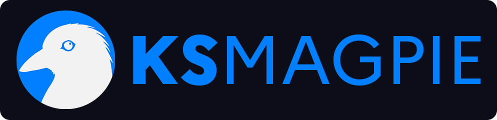
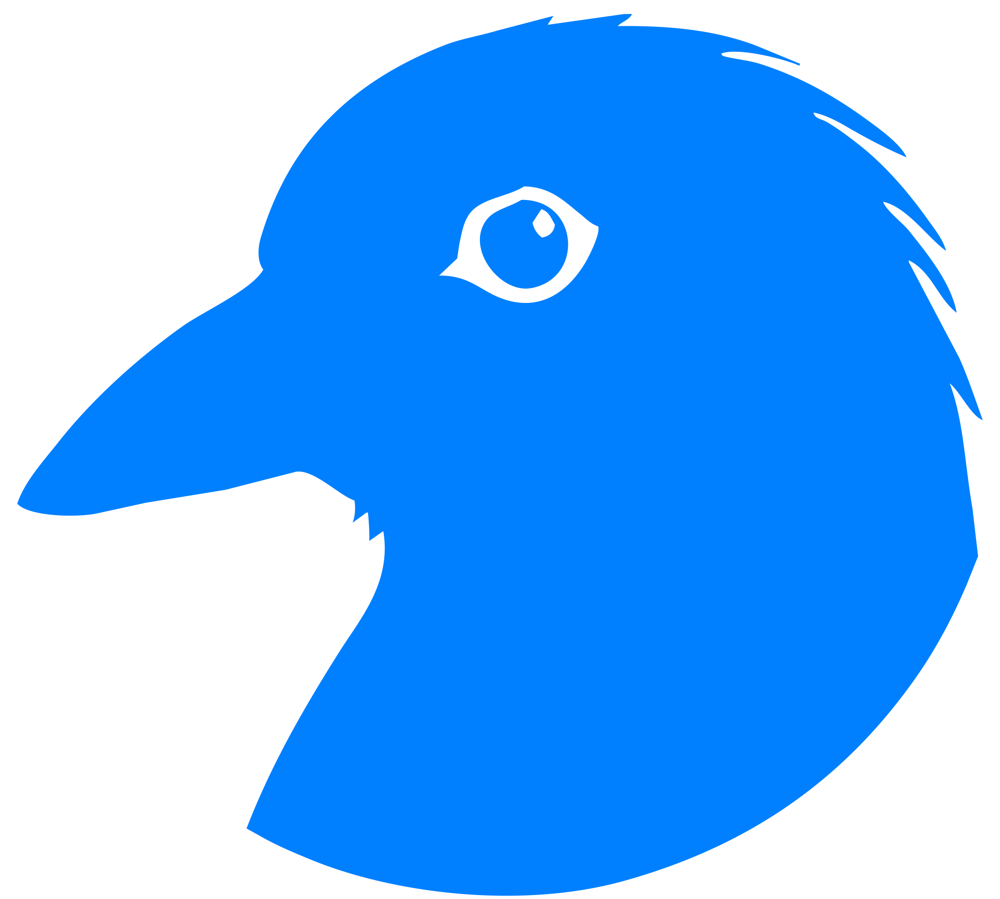

<div align="center">
    
</div>


# 🚀 Magpie: Your All-in-One Self-Hosted Dashboard Solution

<p align="center">Magpie is your comprehensive dashboard solution, bringing together all your self-hosted services effortlessly.</p>

### Work with 


### Language used


 

<h2 align="center">Installation</h2>

###  KSMagpie
```bash
git clone https://github.com/kerogs/Magpie.git
```

###  Composer
```bash
composer install
```

###  Docker
To build it, simply run this command locally.
```bash
docker compose up --build
```

Image result (from ***docker desktop***)


<h2 align="center">Information</h2>

### 🌟 About Magpie
Magpie was born out of the vision to simplify the management of self-hosted applications. Initially conceived as NunaLab, a personal project, Magpie has evolved into a robust platform designed to streamline your self-hosted ecosystem. With a sleek interface and powerful features, Magpie aims to enhance your experience in managing various services while maintaining simplicity and elegance.

### 🔧 Key Features
- Integrated Development Environment (IDE): Develop and manage your projects seamlessly within Magpie's intuitive IDE.
- Chat System: Communicate effortlessly with your team members through Magpie's built-in chat system.
- Forum System: Foster discussions and collaboration with a dedicated forum system integrated into Magpie.
- File Sharing: Share files securely with colleagues or friends using Magpie's file sharing functionality.
- Video Sharing: Collaborate effectively by sharing videos directly through Magpie's video sharing feature.
- Account Management: Easily manage user accounts and permissions with Magpie's user-friendly account management system.
- Extensibility: Extend Magpie's capabilities by integrating external services seamlessly into your dashboard.
- And more future fun stuff...

### 🤝 Join Us
We welcome contributions from the community to make Magpie even better. Whether it's through code contributions, bug reports, or feature suggestions, your participation is invaluable in shaping the future of Magpie.

If you have any questions or feedback, don't hesitate to reach out to us by opening an issue on our repository.

### 📜 License
Magpie is licensed under the Mozilla Public License 2.0 (MPL 2.0).

[](https://opensource.org/licenses/MPL-2.0)

<h2 align="center">Contact</h2>

<div align="center">

[](https://discord.gg/2HGYSAjsWy)
[](https://www.ks-infinite.fr/)
 

</div>

<div align="center">
    
</div>

